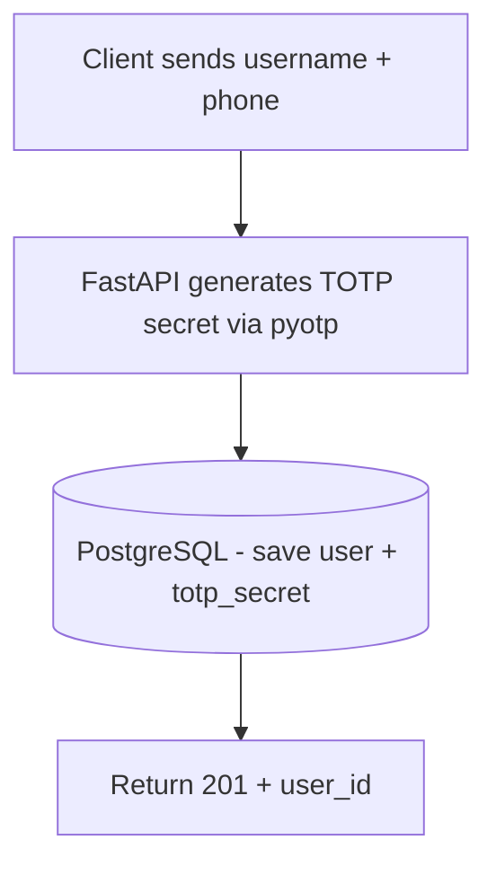
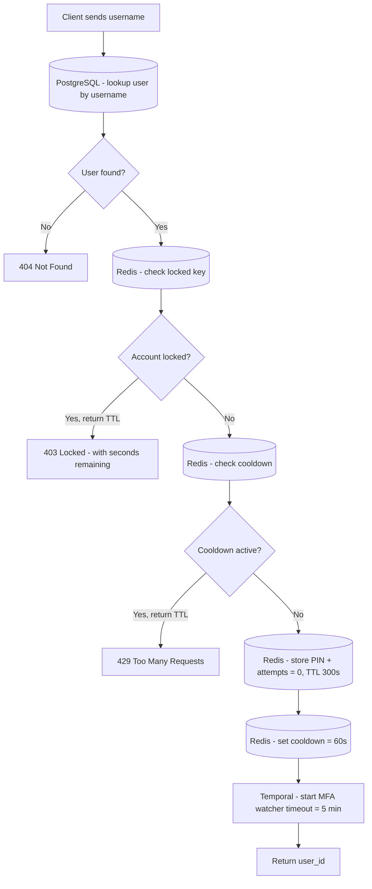
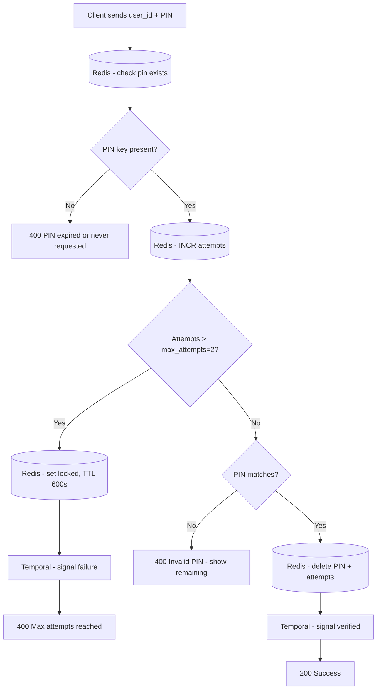
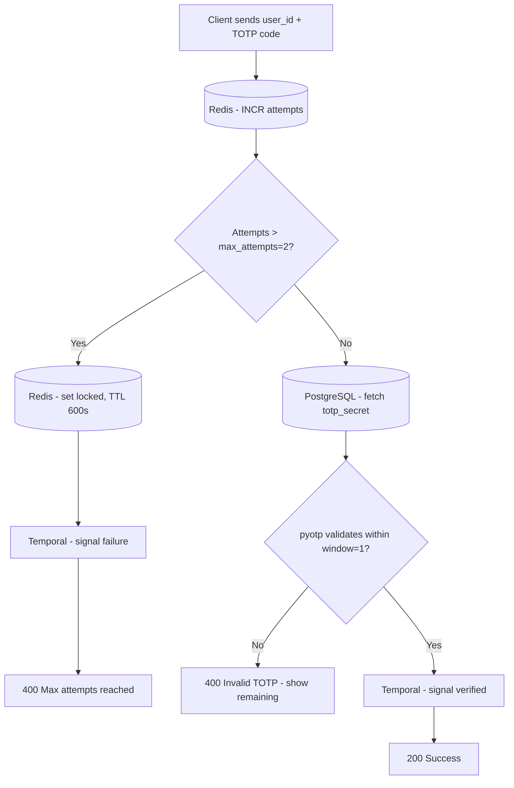
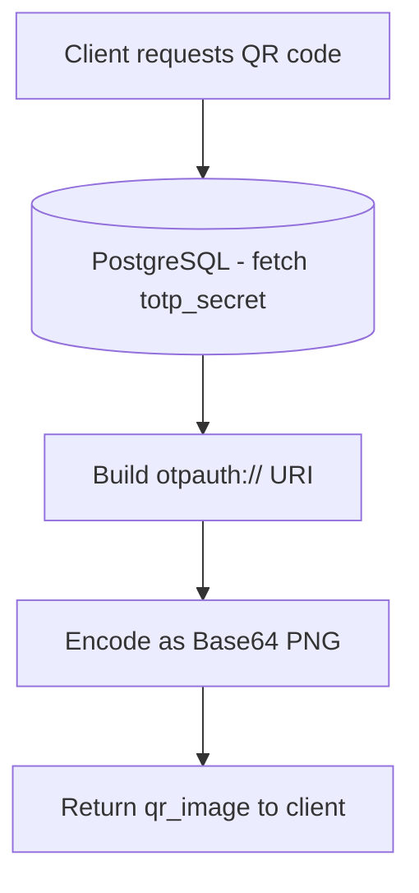

# System Architecture: MFA Gate Server

## Overview

The MFA Gate Server is an asynchronous backend service for multi-factor authentication. The current design combines SMS PIN verification, TOTP verification, Redis-backed ephemeral state, and a Temporal workflow that tracks escalation and account lockout conditions.

## Core Technology Stack

| Component | Technology | Purpose |
| :--- | :--- | :--- |
| Framework | FastAPI | Async REST API and dependency injection. |
| Database | PostgreSQL (SQLModel + asyncpg) | Stores users and permanent TOTP secrets. |
| Cache & State | Redis (redis.asyncio) | Stores PINs, retry counters, cooldowns, and lock flags. |
| Workflow Engine | Temporal | Tracks MFA verification state and escalation lifecycle. |
| Cryptography | pyotp | Generates and validates TOTP codes. |

## Endpoint Reference

| Method | Path | Auth Required | Description |
| :--- | :--- | :---: | :--- |
| POST | `/auth/register` | No | Create a new user and generate a TOTP secret. |
| POST | `/auth/login` | No | Look up the user, store a 6-digit PIN in Redis, enforce 60-second cooldown, and start the Temporal MFA watcher. |
| POST | `/auth/verify` | No | Verify an SMS PIN or TOTP code (unified attempt tracking) and signal Temporal workflow. |
| GET | `/auth/qr-code/{username}` | No | Return a Base64 QR code image for authenticator enrollment with TOTP provisioning URI. |
| POST | `/auth/unlock/{user_id}` | Yes, internal API key | Clear all lockout, PIN, attempt, and cooldown state for a user. |

## Authentication Flow Diagram

### POST /auth/register



### POST /auth/login



### POST /auth/verify - SMS



### POST /auth/verify - TOTP



### GET /auth/qr-code/{username}



## Data Storage Model

### PostgreSQL - persistent identity data

Stores everything that must survive a server restart.

| Field | Type | Notes |
| :--- | :--- | :--- |
| `id` | integer (PK) | Stable identifier for user state and workflow correlation. |
| `username` | string (unique) | Login handle. |
| `phone_number` | string (unique) | Destination for SMS-based MFA. |
| `totp_secret` | string | Base32 secret generated at registration. |

### Redis - ephemeral auth state

All keys are scoped to `user_id` and carry a TTL.

| Key pattern | Value | TTL | Purpose |
| :--- | :--- | :--- | :--- |
| `pin:{user_id}` | 6-digit PIN string | 300s (5 min) | Active SMS PIN for the login attempt. Deleted on successful SMS verification. |
| `attempts:{user_id}` | integer (0-3) | 300s (5 min) | Universal attempt counter for both SMS and TOTP. Incremented on each verify attempt. Lockout when > max_attempts (2). |
| `cooldown:{user_id}` | marker value "1" | 60s (1 min) | Prevents SMS bombing and concurrent PIN requests. Set immediately after login. |
| `locked:{user_id}` | lock reason string | 600s (10 min) | Marks an account as temporarily locked after max attempts or workflow timeout. Checked at login. |

## Key Design Decisions

### Asynchronous I/O

The service uses `async`/`await` throughout. PostgreSQL and Redis access via `redis.asyncio` and `asyncpg` stay non-blocking, so API traffic does not stall the ASGI event loop.

### Separation of state by lifetime

| | SMS (stateful) | TOTP (stateless) |
| :--- | :--- | :--- |
| Storage | Redis (ephemeral) | PostgreSQL (permanent secret) |
| PIN/Secret Expiry | 5-minute PIN TTL (300s) | 30-second moving time window (valid_window=1) |
| Attempt Tracking | Redis counter (max 2 attempts, shared with TOTP) | Redis counter (max 2 attempts, shared with SMS) |
| Verification | String comparison against stored PIN | `pyotp.TOTP.verify()` with time drift tolerance |
| Cleanup needed? | Yes, PIN deleted on success or unlock | No temporary PIN stored, attempt counter shared globally |
| Cooldown | 60-second cooldown prevents PIN re-request | No separate cooldown (covered by attempt window) |

### Security behaviours worth noting

- **PIN generation:** Uses Python `secrets.randbelow(900000) + 100000` for cryptographically secure 6-digit values.
- **Atomic operations:** PIN creation and attempt counter initialization via Redis pipeline transactions.
- **Login cooldown:** 60-second cooldown per user prevents SMS bombing and concurrent PIN requests.
- **Unified attempt tracking:** Both SMS and TOTP share the same `attempts:{user_id}` counter. Lockout occurs after 2 failed attempts from either method.
- **Account lockout:** Triggered by max attempts or 5-minute Temporal workflow timeout. Lockout duration is 10 minutes (600s).
- **Temporal escalation:** MFA workflow waits up to 5 minutes for verification signal. On timeout or failure signal, it triggers `lock_account_activity`.
- **TOTP time window:** `valid_window=1` allows ±30 seconds drift for clock skew between client and server.
- **Unlock endpoint:** Protected by internal API key; clears all auth state (`pin`, `attempts`, `cooldown`, `locked`).

### Infrastructure-agnostic testing

The Pytest suite overrides PostgreSQL, Redis, and Temporal dependencies with in-memory fakes. This keeps the auth flow testable without requiring external services during CI.

## Temporal Workflow: MFA Escalation Watcher

The `MFAEscalationWatcher` workflow tracks verification state across the entire login session:

```python
@workflow.defn
class MFAEscalationWatcher:
    @workflow.run
    async def run(self, user_id: int) -> str:
        # Waits for either verification signal or timeout
        await workflow.wait_condition(
            lambda: self.is_verified or self.is_failed,
            timeout=timedelta(minutes=5),  # 5-minute window
        )
        
        if self.is_verified:
            return "verified"
        else:
            # Timeout or failure signal triggers account lock
            await workflow.execute_activity(
                lock_account_activity,
                args=[user_id, "timeout or max_attempts"],
                start_to_close_timeout=timedelta(seconds=10),
            )
            return "locked:timeout"
```

**Signals:**
- `mark_as_verified()`: Sent by `/auth/verify` on successful SMS or TOTP validation.
- `mark_as_failed()`: Sent by `/auth/verify` when max attempts (2) is exceeded.

**Outcomes:**
- **"verified"**: User successfully authenticated; workflow completes cleanly.
- **"locked:timeout"**: No signal received within 5 minutes; account is locked for 10 minutes.
- **"locked:max_attempts"**: Failure signal received; account is locked for 10 minutes.
