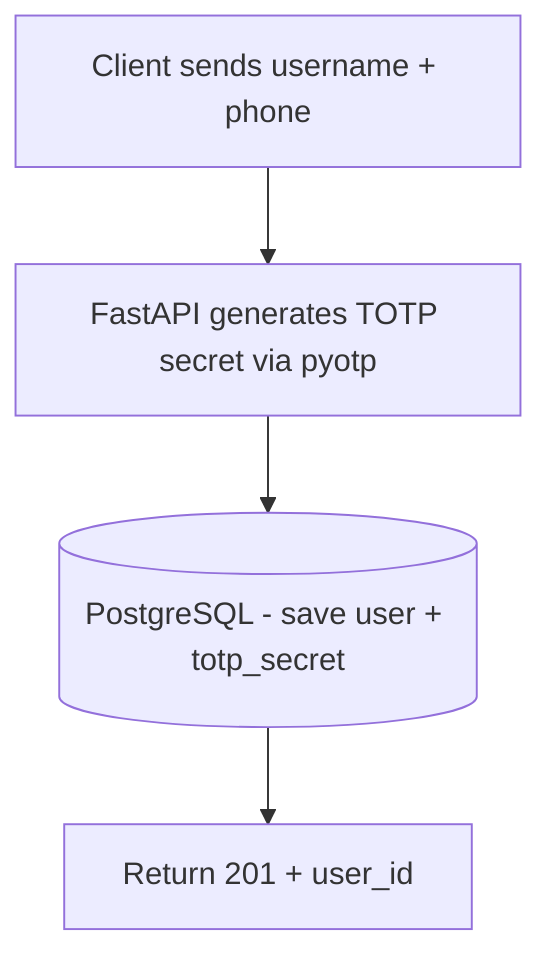
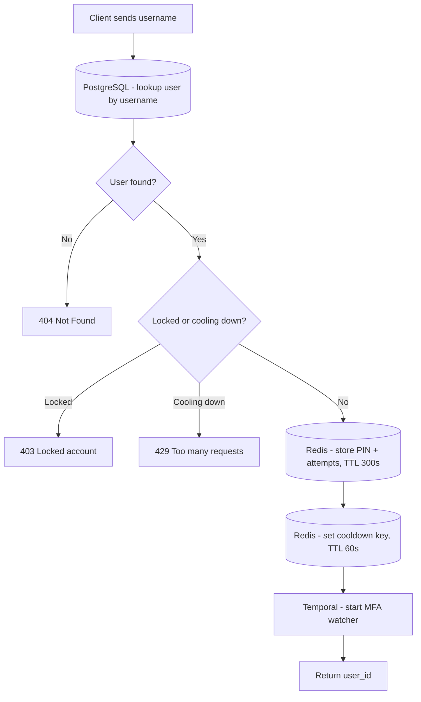
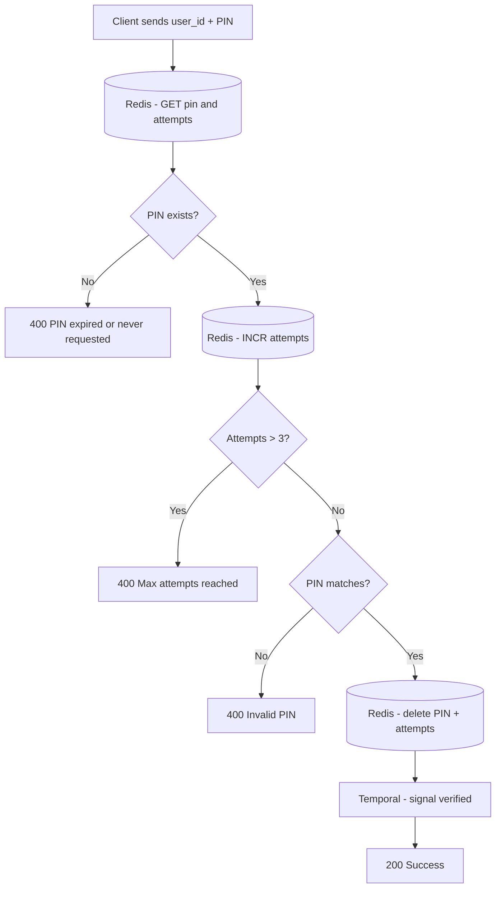
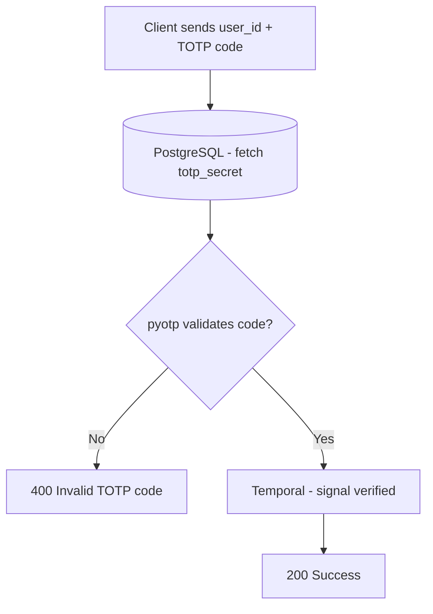
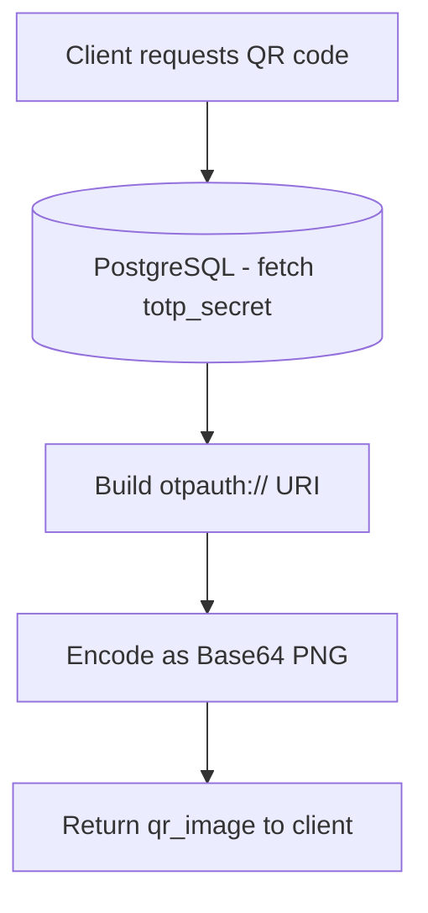

# System Architecture: MFA Gate Server

## Overview

The MFA Gate Server is an asynchronous backend service for multi-factor authentication. The current design combines SMS PIN verification, TOTP verification, Redis-backed ephemeral state, and a Temporal workflow that tracks escalation and account lockout conditions.

## Core Technology Stack

| Component | Technology | Purpose |
| :--- | :--- | :--- |
| Framework | FastAPI | Async REST API and dependency injection. |
| Database | PostgreSQL (SQLModel + asyncpg) | Stores users and permanent TOTP secrets. |
| Cache & State | Redis (redis.asyncio) | Stores PINs, retry counters, cooldowns, and lock flags. |
| Workflow Engine | Temporal | Tracks MFA verification state and escalation lifecycle. |
| Cryptography | pyotp | Generates and validates TOTP codes. |

## Endpoint Reference

| Method | Path | Auth Required | Description |
| :--- | :--- | :---: | :--- |
| POST | `/auth/register` | No | Create a new user and generate a TOTP secret. |
| POST | `/auth/login` | No | Look up the user, store a 6-digit PIN in Redis, apply cooldown checks, and start the Temporal watcher. |
| POST | `/auth/verify` | No | Verify an SMS PIN or TOTP code and signal the Temporal workflow. |
| GET | `/auth/qr-code/{username}` | No | Return a Base64 QR code image for authenticator enrollment. |
| POST | `/auth/unlock/{user_id}` | Yes, internal API key | Clear lockout, PIN, and cooldown state for a user. |

## Authentication Flow Diagram

### POST /auth/register

### POST /auth/login

### POST /auth/verify - SMS

### POST /auth/verify - TOTP

### GET /auth/qr-code/{username}

## Data Storage Model

### PostgreSQL - persistent identity data

Stores everything that must survive a server restart.

| Field | Type | Notes |
| :--- | :--- | :--- |
| `id` | integer (PK) | Stable identifier for user state and workflow correlation. |
| `username` | string (unique) | Login handle. |
| `phone_number` | string (unique) | Destination for SMS-based MFA. |
| `totp_secret` | string | Base32 secret generated at registration. |

### Redis - ephemeral auth state

All keys are scoped to `user_id` and carry a TTL.

| Key pattern | Value | TTL | Purpose |
| :--- | :--- | :--- | :--- |
| `pin:{user_id}` | 6-digit PIN string | 300s | Active SMS PIN for the login attempt. |
| `attempts:{user_id}` | integer string | 300s | Failed PIN counter with lockout at more than 3 attempts. |
| `cooldown:{user_id}` | marker value | 60s | Prevents repeated PIN requests during the SMS cooldown window. |
| `locked:{user_id}` | lock reason | 600s | Marks an account as temporarily locked after escalation. |

## Key Design Decisions

### Asynchronous I/O

The service uses `async`/`await` throughout. PostgreSQL and Redis access stay non-blocking, so API traffic does not stall the ASGI event loop.

### Separation of state by lifetime

| | SMS (stateful) | TOTP (stateless) |
| :--- | :--- | :--- |
| Storage | Redis (ephemeral) | PostgreSQL (permanent secret) |
| Expiry | 5-minute PIN TTL plus 60-second cooldown | 30-second moving time window |
| Verification | String comparison against stored PIN | `pyotp.TOTP.verify()` |
| Cleanup needed? | Yes, on success or unlock | No temporary state stored |

### Security behaviours worth noting

- PIN generation uses a cryptographically secure random 6-digit value.
- PIN writes and attempt resets are performed atomically in a Redis pipeline.
- Login requests are rate-limited by a cooldown key to reduce repeated SMS requests.
- A Temporal workflow tracks verification progress and supports escalation and lockout handling.
- The unlock endpoint is protected by an internal API key dependency.

### Infrastructure-agnostic testing

The Pytest suite overrides PostgreSQL, Redis, and Temporal dependencies with in-memory fakes. This keeps the auth flow testable without requiring external services during CI.
