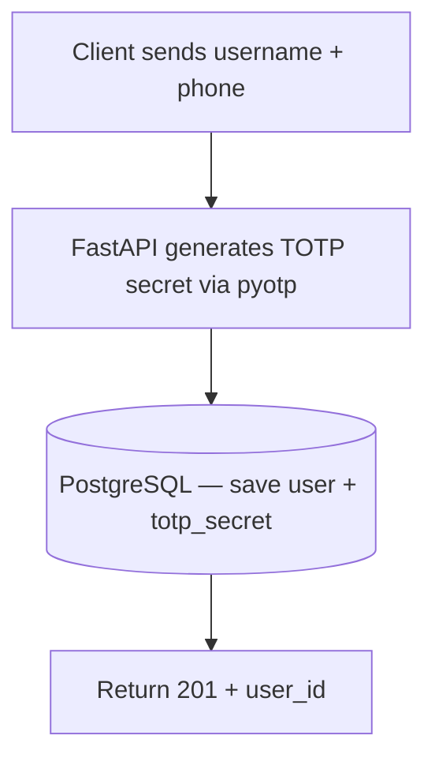
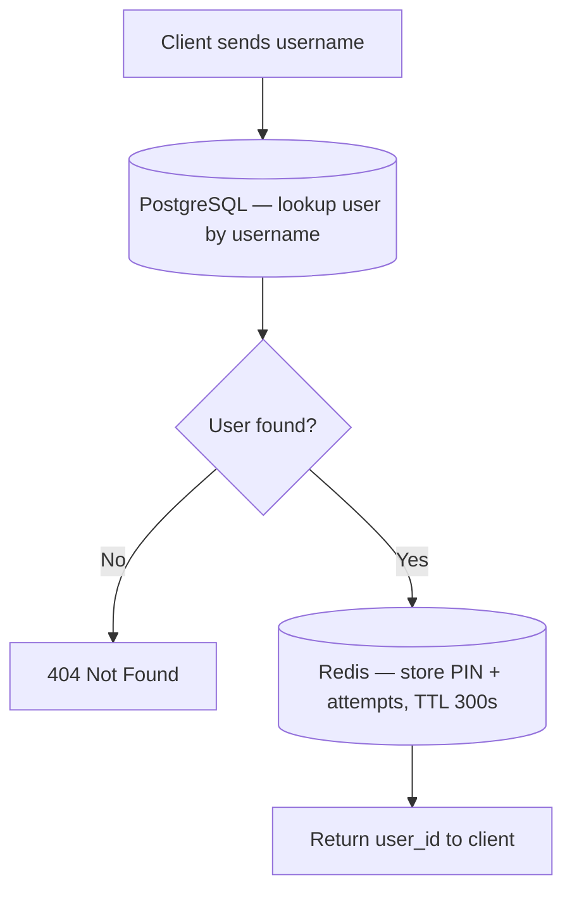
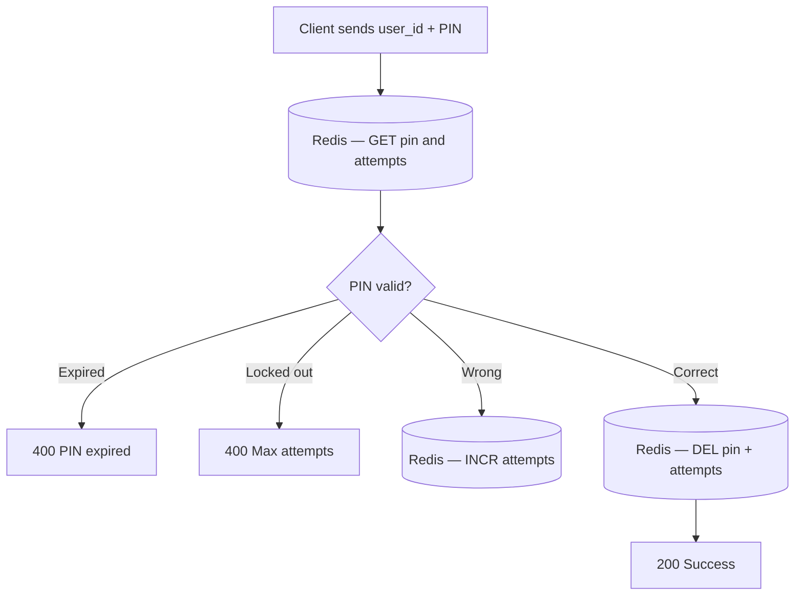
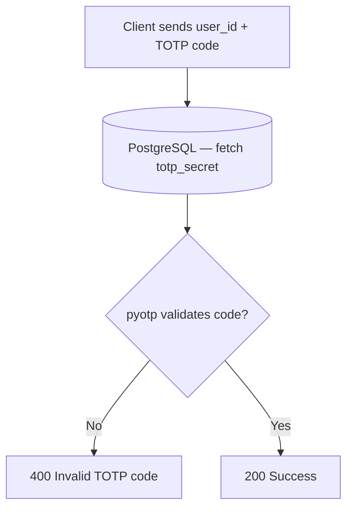
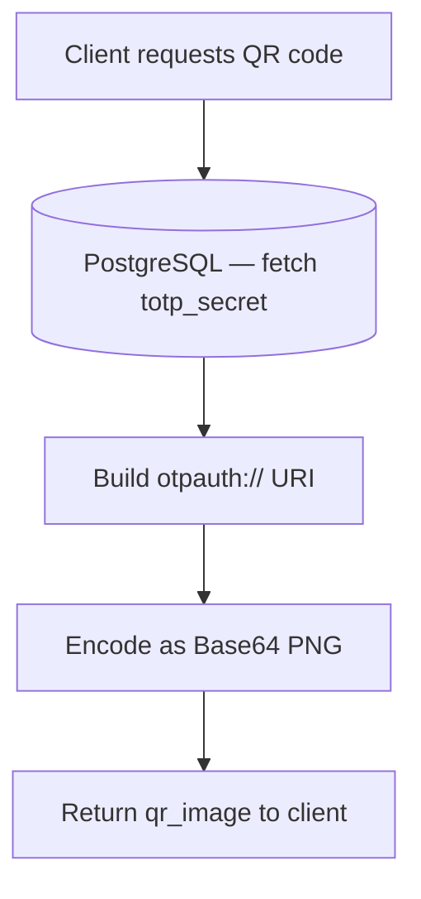

# System Architecture: MFA Gate Server

## Overview

The MFA Gate Server is an asynchronous backend service designed to orchestrate Multi-Factor Authentication. It implements two distinct security models: a stateful SMS-based PIN verification system and a stateless Time-Based One-Time Password (TOTP) system.

---

## Core Technology Stack

| Component | Technology | Purpose |
| :--- | :--- | :--- |
| **Framework** | FastAPI | Provides a high-performance, asynchronous REST API infrastructure. |
| **Database** | PostgreSQL (SQLModel + asyncpg) | Acts as the persistent storage layer for user accounts and permanent TOTP Base32 secrets. |
| **Cache & State** | Redis (redis.asyncio) | Manages transient state for SMS PINs, handling 5-minute TTL expirations and atomic lockout counters. |
| **Cryptography** | pyotp | Generates and validates HMAC-SHA1 time-based tokens for the Authenticator app flow. |

---

## Endpoint Reference

| Method | Path | Auth Required | Description |
| :--- | :--- | :---: | :--- |
| `POST` | `/auth/register` | No | Create a new user account. Generates and stores a TOTP secret. |
| `POST` | `/auth/login` | No | Look up user and dispatch a 6-digit SMS PIN via Redis. |
| `POST` | `/auth/verify` | No | Verify an SMS PIN or TOTP code to complete authentication. |
| `GET` | `/auth/qr-code/{username}` | No | Return a Base64 QR code image for authenticator app enrollment. |

---

## Authentication Flow Diagram

### POST /auth/register

### POST /auth/login

### POST /auth/verify — SMS

### POST /auth/verify — TOTP

### GET /auth/qr-code/{username}

---

## Data Storage Model

### PostgreSQL — persistent identity data

Stores everything that must survive a server restart.

| Field | Type | Notes |
| :--- | :--- | :--- |
| `id` | integer (PK) | Auto-generated, used as the stable identifier across all services. |
| `username` | string (unique) | Login handle. Unique constraint enforced at DB level. |
| `phone_number` | string (unique) | Destination for SMS PINs. |
| `totp_secret` | string | Base32 secret generated at registration. Never changes after creation. |

### Redis — transient auth state

All keys are scoped to `user_id` and carry a TTL. Nothing in Redis is permanent.

| Key pattern | Value | TTL | Purpose |
| :--- | :--- | :--- | :--- |
| `pin:{user_id}` | 6-digit PIN string | 300s | The active SMS PIN for this login attempt. |
| `attempts:{user_id}` | integer string | 300s | Running count of failed PIN submissions. Lockout triggers at ≥ 3. |

> Both keys are written atomically inside a Redis pipeline transaction and deleted together on successful verification.

---

## Key Design Decisions

### Asynchronous I/O

The entire application stack uses `async`/`await`. By using `asyncpg` for PostgreSQL and `redis.asyncio` for Redis, the server ensures that database queries and cache lookups never block the ASGI event loop, keeping the server responsive under concurrent load.

### Separation of state by lifetime

| | SMS (stateful) | TOTP (stateless) |
| :--- | :--- | :--- |
| **Storage** | Redis (ephemeral) | PostgreSQL (permanent) |
| **Expiry** | 5-minute TTL | 30-second time window (mathematical) |
| **Verification** | String comparison against stored PIN | `pyotp.TOTP.verify()` against current epoch |
| **Cleanup needed?** | Yes — keys deleted on success | No — nothing was written |

SMS PINs must exist for exactly 5 minutes. This state is offloaded to Redis rather than in-memory Python structures to guarantee process resilience across restarts. TOTP codes require no temporary storage — the server mathematically verifies the token using the permanent user secret and the current epoch time.

### Security behaviours worth noting

- **PIN lockout is pre-check, not post-check.** The attempt counter is read *before* the PIN is compared, so a locked-out user cannot even attempt a guess.
- **Atomic pipeline writes on login.** `pin:{user_id}` and `attempts:{user_id}` are written in a single Redis pipeline with `MULTI/EXEC`, eliminating partial-write race conditions.
- **Timing note.** Returning `404` for unknown usernames during login leaks whether an account exists. Consider returning `200` with a dummy delay for production hardening.

### Infrastructure-agnostic testing

The Pytest suite uses FastAPI's dependency injection to swap production PostgreSQL and Redis clients with `aiosqlite` and `fakeredis`. This allows the CI/CD pipeline to execute hundreds of isolated tests in milliseconds without Docker container overhead.
